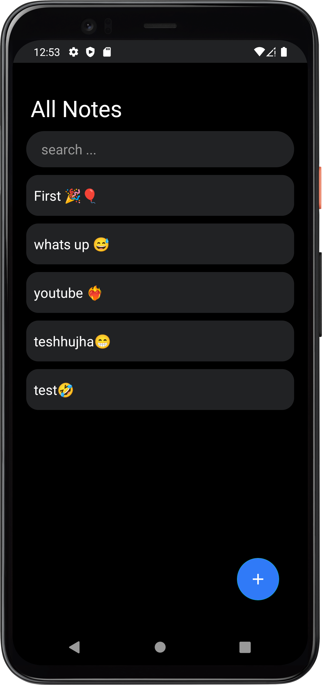

# **Note Me** 

### **Note Me** | a notes generator app built for a Room tutorial on my YouTube channel

Watch the tutorial on Youtube here [NoteME Tutorial](https://www.youtube.com/watch?v=KS89hz6n3cI) .

## Application Install

***You can Install and test latest Note Me app from below 👇***

## About
 
- Clean and Simple UI.
- Best and Clean Code Quality following Modern Android Development
- Clean Architecture Approach by uncle bob

## 📸 Screenshots 

|   |   |   |
|---|---|---|
||  

## Built With 🛠
- [Kotlin](https://kotlinlang.org/) - First class and official programming language for Android development.
- [Coroutines](https://kotlinlang.org/docs/reference/coroutines-overview.html) - For asynchronous and more..
- [Flow](https://kotlin.github.io/kotlinx.coroutines/kotlinx-coroutines-core/kotlinx.coroutines.flow/-flow/) - A cold asynchronous data stream that sequentially emits values and completes normally or with an exception.
 - [StateFlow](https://developer.android.com/kotlin/flow/stateflow-and-sharedflow) - StateFlow is a state-holder observable flow that emits the current and new state updates to its collectors.
- [Android Architecture Components](https://developer.android.com/topic/libraries/architecture) - Collection of libraries that help you design robust, testable, and maintainable apps.
  - [ViewModel](https://developer.android.com/topic/libraries/architecture/viewmodel) - Stores UI-related data that isn't destroyed on UI changes. 
- [Dependency Injection](https://developer.android.com/training/dependency-injection) - 
  - [Hilt-Dagger](https://dagger.dev/hilt/) - Standard library to incorporate Dagger dependency injection into an Android application.
  - [Hilt-ViewModel](https://developer.android.com/training/dependency-injection/hilt-jetpack) - DI for injecting `ViewModel`.
- [Room](https://developer.android.com/jetpack/androidx/releases/room) - an abstraction layer over SQLite to allow for more robust database access while harnessing the full power of SQLite.
- [Material Components for Android](https://github.com/material-components/material-components-android) - Modular and customizable Material Design UI components for Android.
    
---

## If you like my projects you can buy me a cup of coffee
  

 ## Contact
you can connect with me here 💙 [LinkedIn](https://www.linkedin.com/in/mathroda/) .
